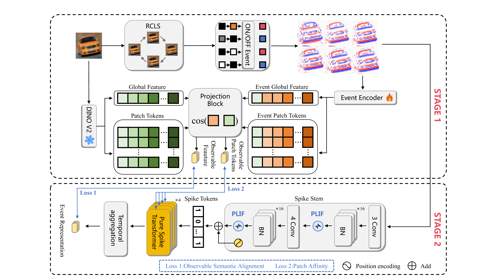
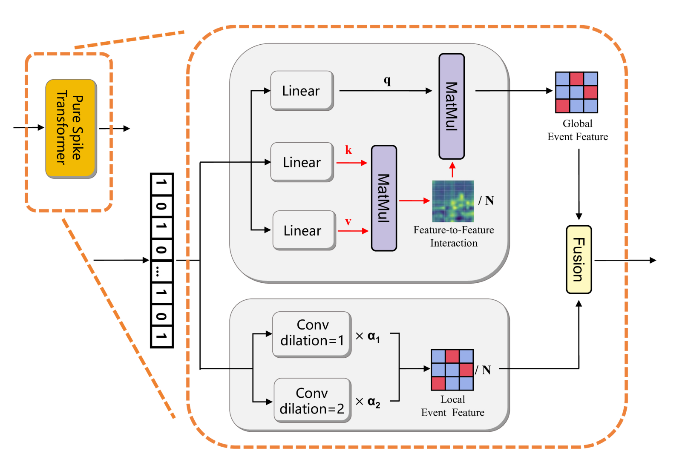
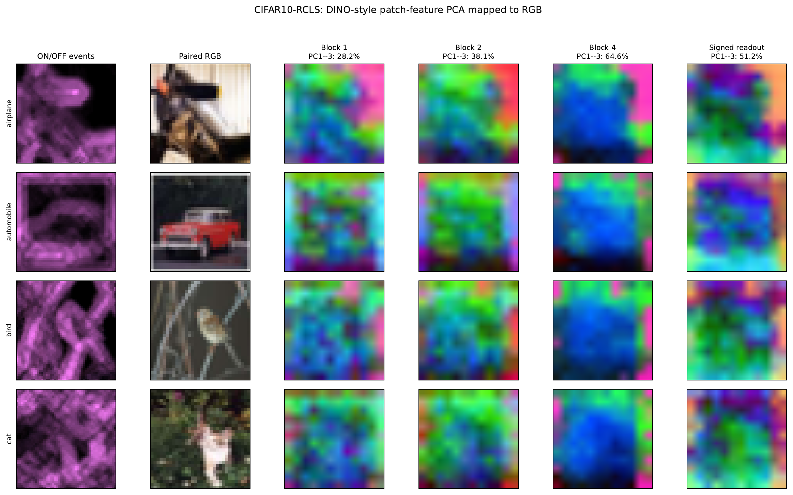
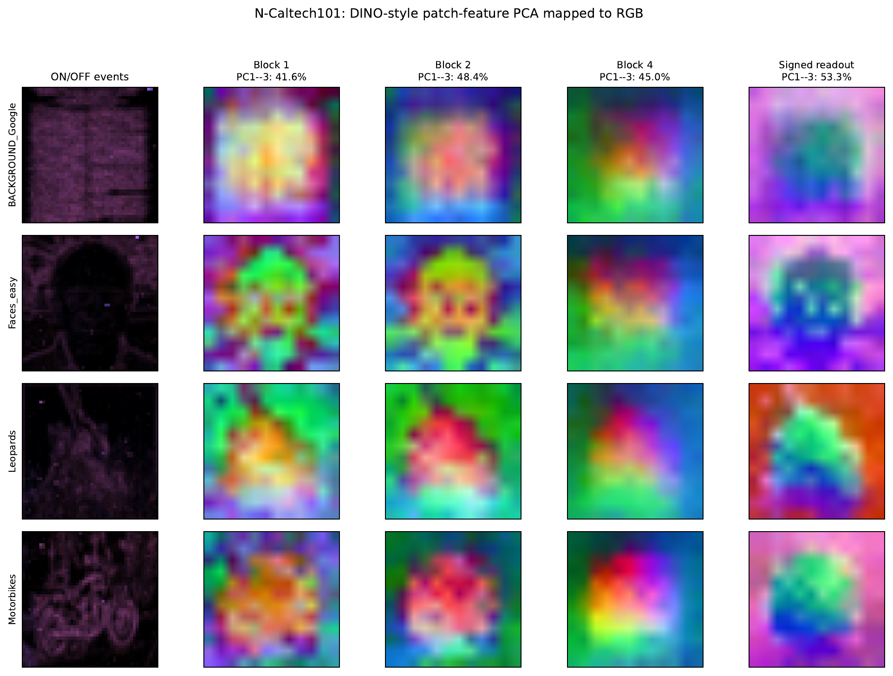
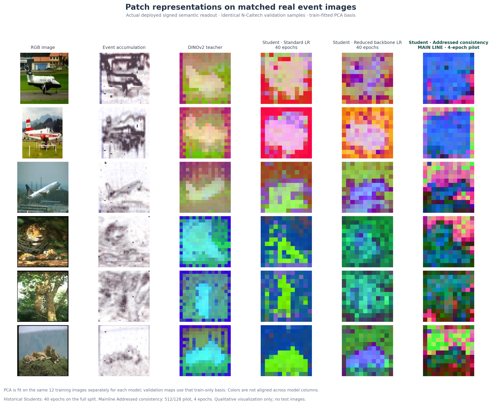
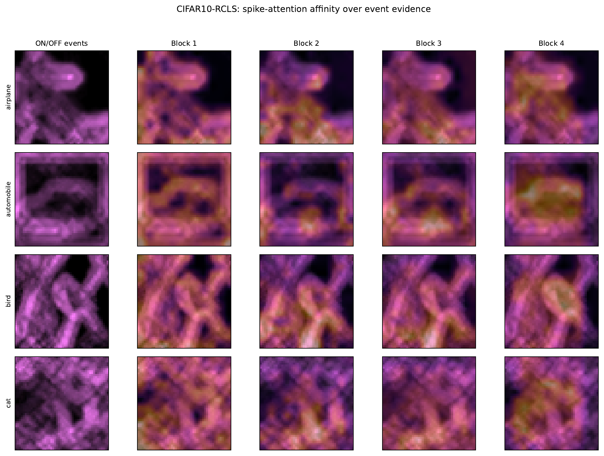
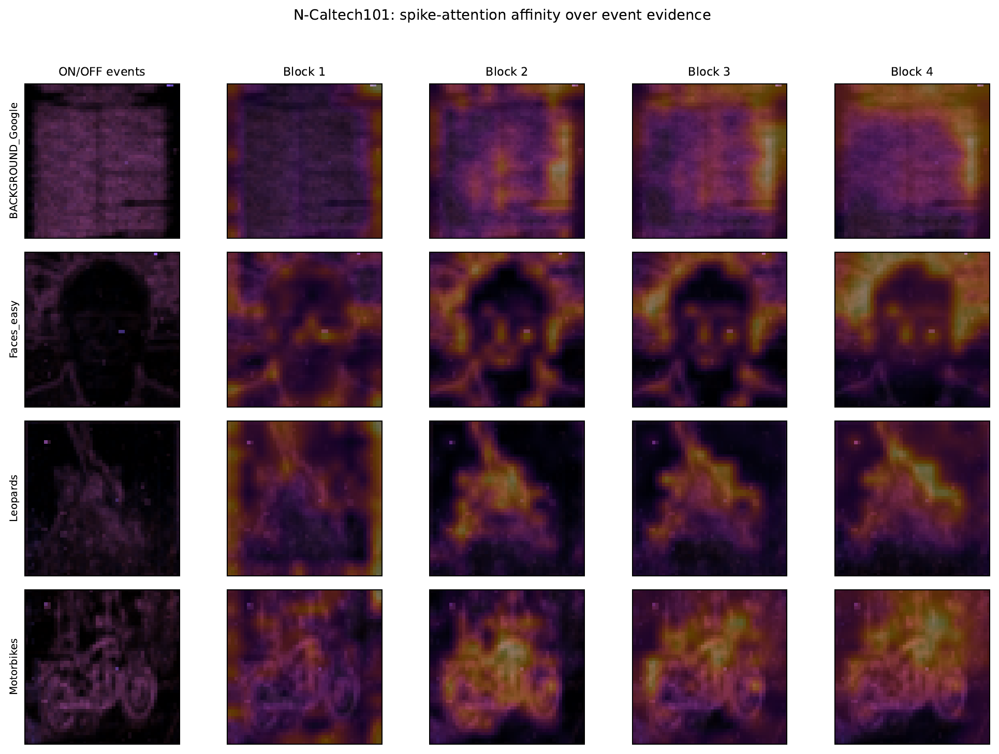
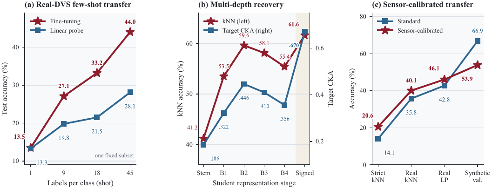
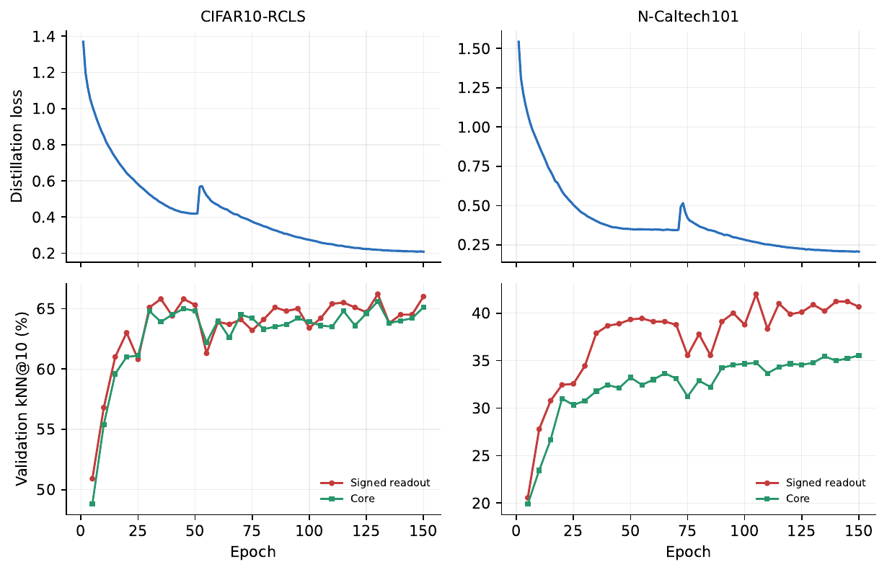

# RGB-to-DVS Pure-Spike Representation Distillation

This repository contains the training and evaluation code for transferring RGB foundation-model semantics to an event-driven spiking representation. During training, paired RGB and DVS observations are used to construct event-observable semantic targets. The PureSpikeFormer student is optimized on DVS inputs; at inference, the RGB teacher, event-side target estimator, bridge, and target cache are not required.

The released training entry point uses a four-block, 384-dimensional PureSpikeFormer with six attention heads, BNTT normalization, PLIF neurons, DINOv2 ViT-S/14 initialization, and a signed spike-rate readout. Intermediate student tokens are binary spikes; the final normalized, rate-coded embedding is continuous. “Label-free” refers to the student representation objective; any supervision used in offline target-cache construction is a separate stage and should be reported with the experiment protocol.

## Method overview



The overview shows the training-time teacher and event-observable bridge, together with the deployed event-only student path. The teacher and bridge define which semantic information is transferred; the deployed encoder processes only event frames.

### PureSpikeFormer block



The block uses binary Q/K/V spike tokens for global interaction and a dilated local event-feature path to preserve neighborhood structure before fusion. Membrane states remain internal to the spiking computation. The training example below enables the local-structure path shown here.

## Qualitative patch representations

The paper includes layer-wise PCA-to-RGB maps on CIFAR10-RCLS and N-Caltech101. They visualize spatial feature structure across the event input, intermediate student blocks, and signed readout. PCA colors are feature coordinates; they do not have class meaning by themselves.

### CIFAR10-RCLS



Four held-out examples are shown with their ON/OFF events, paired RGB images, and PCA maps from Blocks 1, 2, 4, and the signed readout.

### N-Caltech101



The displayed categories include `Faces_easy`, `Leopards`, and `Motorbikes`; the figure follows the paper's layer-wise PCA-to-RGB protocol.

### Matched student comparison



This comparison uses the same six validation examples for the RGB images, event accumulations, RGB-DINOv2 teacher, and three students. PCA is fitted separately for each model on the same 12 training examples, then applied to validation maps; colors therefore do not correspond across model columns. No test examples are shown. `Addressed consistency` is marked as the main line; that checkpoint is a 4-epoch pilot, while the two historical student checkpoints were trained for 40 epochs. This panel is a qualitative, non-compute-matched comparison. Sample selection and extraction details are recorded in [`representation_pca_provenance.json`](representation_pca_provenance.json).

## Spike-attention affinity

The maps visualize normalized Q-K affinity over spatial key tokens, overlaid on polarity-aware event evidence. They show how the spiking Transformer blocks weight event-supported locations; they are affinity maps, not softmax attention probabilities.

### CIFAR10-RCLS



### N-Caltech101



Each figure shows the accumulated ON/OFF event evidence followed by the affinity maps from Blocks 1–4 for four held-out examples. The N-Caltech101 examples include `Faces_easy`, `Leopards`, and `Motorbikes`.

## Repository contents

- `code/core/`: student architecture, event dataset readers, and transforms.
- `code/train/`: training entry points, including the evaluation-safe trainer.
- `code/tools/`: teacher-target preparation, event generation, and representation/downstream evaluation utilities.
- `tests/`: a fast CPU smoke test for the model's tensor and spike-output contract. It uses synthetic input and does not measure representation quality; use the dataset-based evaluation tools for empirical results.

For new runs, use `train_clean_observable_spikeformer_eval_safe.py`. It keeps the train-only target-cache protocol separate from validation. When reporting historical results, record the training entry point and source revision used to produce each checkpoint.

## Environment and software check

Python 3.10 or newer is recommended. Install the packages in `requirements.txt` and use a PyTorch build appropriate for your hardware. DINOv2 weights are loaded through the local PyTorch Hub cache when requested; they are not included here.

Run the CPU smoke test with:

```bash
python -m pytest -q
```

Inspect training options with:

```bash
python code/train/train_clean_observable_spikeformer_eval_safe.py --help
```

## Training

Prepare event frames, a locked train/validation split manifest, and a train-only observable RGB target cache. These assets are supplied by the user and are not bundled. A typical N-Caltech101 run is:

```bash
python code/train/train_clean_observable_spikeformer_eval_safe.py \
  --project-root . \
  --dataset-name ncaltech101 \
  --data-root /path/to/ncaltech101_event_data \
  --split-manifest /path/to/student_split.json \
  --target-cache /path/to/observable_train_targets.pt \
  --output-dir runs/ncaltech101/example \
  --dino-init --signed-readout --multidepth-readout \
  --local-structure-mixer \
  --gpu 0
```

The paths are placeholders. Keep datasets, caches, and checkpoints outside Git. Record the code revision, source hashes, split manifest, target-cache provenance, seed, and evaluation protocol for each run. Target-cache preparation utilities are in `code/tools/`; check each tool's `--help` and the selected dataset's terms before use.

## Evaluation

`code/tools/evaluate_event_classification.py`, `evaluate_fewshot_lp_ft_cifar10dvs.py`, and `evaluate_downstream_protocols.py` provide frozen-feature and downstream evaluation entry points. Report the split, checkpoint, teacher/input modality, label budget, and evaluation head with every score. Do not interpret PCA appearance as a substitute for quantitative evaluation or compare scores from different protocols as if they were the same benchmark.

## Quantitative results and training curves

The paper reports 44.0% test accuracy for 45-shot fine-tuning on real CIFAR10-DVS, compared with 28.1% for a linear probe on the same fixed subset (seed 42). The figure also shows layer-wise kNN/target-CKA recovery on CIFAR10-RCLS. Its sensor-calibration panel is an earlier diagnostic and is not directly comparable with the other panels.



The following curves show the 150-epoch distillation losses and validation kNN@10 histories for CIFAR10-RCLS and N-Caltech101. Validation labels are used by the detached evaluator, not by the student training objective.



## Data and artifacts

The repository does not contain datasets, raw event streams or RGB images, frame caches, teacher targets, DINO weights, checkpoints, result directories, or training logs. The README figures are compact qualitative visualizations derived from selected samples. The `.gitignore` blocks common dataset and model-artifact extensions as an additional safeguard.
